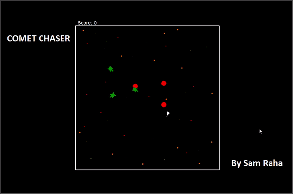

# Space Wars
A fun interactive game made using the Python Turtle library.

Instructions:

Use the arrow keys to move up/down/left/right and the space bar to shoot missiles at the red comets for 100 points. Do not shoot the space turtles as they are your friend and will cost you -50 points. You should also avoid impact with the comets as they will cost you -100 points.

ENJOY!
